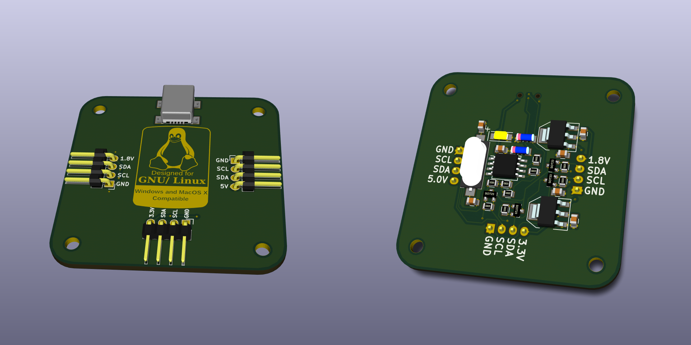

# I²C Tiny USB

This is my variant of i2c-tiny-usb from Dr. Till Harbaum. You
can find the original project on his homepage:

http://www.harbaum.org/till/i2c_tiny_usb/index.shtml

I modified the PCB schematics to fit my requirements and created
a nice case for it. The actual firmware for the ATtiny is exactly
the same. Instead of the ATtiny45 I used an ATtiny85, since it's
cheaper nowadays.

The PCB and the case are licensed under CC-BY 3.0:

https://creativecommons.org/licenses/by/3.0/

# Images

-- Sebastian Reichel <sre@ring0.de>
